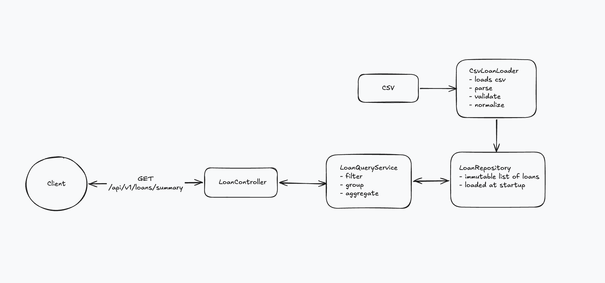

# Loans API

A read-only HTTP API that loads the LendingClub 2017 Q4 loan file into memory at startup and serves
filtered, grouped summaries of it.

Kotlin 2.3, Spring Boot 4.1, Gradle, Java 21.

## Setup and run

**Requirements:** JDK 21. Gradle itself is downloaded by the wrapper.

**1. Add the data file.** The CSV is ~109 MB and is not part of the repository.
[Download it from Google Drive](https://drive.google.com/file/d/1RdRVZdy_UYknm0Qr9clXAlQIi0Pts9VI/view)
and place it at:

```
data/LoanStats_securev1_2017Q4.csv
```

**2. Start the app.**

```bash
./gradlew bootRun
```

The file is read once, before the server starts accepting requests (about 3 seconds on a laptop). The log
shows how the load went:

```
Accepted 118636 loans in 2900 ms, 0 rejected {}
```

If the file is missing or unreadable the app refuses to start and names the path it looked at.

**3. Call it.** The server listens on `http://localhost:8080`.

```bash
curl "http://localhost:8080/api/v1/loans/options"
curl "http://localhost:8080/api/v1/loans/summary?groupBy=grade&state=CA,NY&ficoMin=700"
```

## Tests

```bash
./gradlew test
```

The tests do not need the full data file. They run against `src/test/resources/sample_300.csv`, a
298-loan slice of the real file that keeps its notes line, header, and footer totals.

| Test class | What it covers |
|---|---|
| `CsvLoanLoaderTest` | Parsing and normalizing each field, skipping the notes line and footer, rejecting invalid rows with the right reason, reconciling funded amounts against the footer, missing and empty files |
| `LoanQueryServiceTest` | Every `groupBy` option, each filter alone and combined, inclusive range bounds, group totals adding up to the overall totals, empty results |
| `LoanControllerTest` | Both endpoints over HTTP (MockMvc), defaults, case and whitespace normalization, blank parameters, `400` responses listing every invalid parameter |

## API

### `GET /api/v1/loans/summary`

Aggregated stats for the loans matching the filters, in total and per group. Every parameter is
optional; with none given, all loans are summarized by grade.

| Parameter | Format | Meaning |
|---|---|---|
| `groupBy` | `grade` (default), `state`, `month`, `ficoBand`, `purpose` | Attribute to group by |
| `grade` | comma-separated, case-insensitive, e.g. `A,B` | Loan matches if it has any of the values |
| `state` | comma-separated, case-insensitive, e.g. `CA,NY` | Same |
| `purpose` | comma-separated, exact, e.g. `debt_consolidation` | Same |
| `from`, `to` | `yyyy-MM` | Inclusive issue month range |
| `ficoMin`, `ficoMax` | whole number, 300 to 850 | Inclusive range, compared to the midpoint of the loan's FICO range |

Filters on different parameters are combined with AND. A blank parameter means "no filter".

Example: `GET /api/v1/loans/summary?groupBy=grade&state=CA,NY&ficoMin=700`

```json
{
  "groupBy": "grade",
  "filters": { "state": ["CA", "NY"], "ficoMin": 700 },
  "totals": {
    "loanCount": 13622,
    "totalLoanAmount": 225873075,
    "avgLoanAmount": 16581.49,
    "avgInterestRate": 11.03,
    "weightedAvgInterestRate": 11.24
  },
  "groups": [
    {
      "key": "A",
      "loanCount": 4876,
      "totalLoanAmount": 73989575,
      "avgLoanAmount": 15174.24,
      "avgInterestRate": 6.90,
      "weightedAvgInterestRate": 6.85,
      "percentOfTotalAmount": 32.76
    },
    {
      "key": "B",
      "loanCount": 4553,
      "totalLoanAmount": 78724425,
      "avgLoanAmount": 17290.67,
      "avgInterestRate": 10.50,
      "weightedAvgInterestRate": 10.47,
      "percentOfTotalAmount": 34.85
    }
  ]
}
```

(Groups C to G omitted here.) Groups are sorted by key. `weightedAvgInterestRate` is weighted by loan
amount. `percentOfTotalAmount` is the group's share of the loan amount of all *matching* loans, not of
the whole dataset. Averages and percentages are rounded to 2 decimal places.

### `GET /api/v1/loans/options`

The values present in the dataset, which are the values accepted as filters by `/summary`.

```json
{
  "recordCount": 118636,
  "issueMonths": ["2017-10", "2017-11", "2017-12"],
  "grades": ["A", "B", "C", "D", "E", "F", "G"],
  "states": ["AK", "AL", "AR", "..."],
  "purposes": ["car", "credit_card", "debt_consolidation", "..."],
  "ficoBands": ["660-679", "680-699", "700-719", "..."]
}
```

### Errors

Invalid parameters return `400`. All invalid parameters are reported in one response rather than only the first.

`GET /api/v1/loans/summary?groupBy=foo&ficoMin=10&from=2017-13`

```json
{
  "status": 400,
  "title": "Invalid request parameters",
  "detail": "3 parameter(s) could not be accepted.",
  "instance": "/api/v1/loans/summary",
  "errors": [
    { "parameter": "groupBy", "message": "must be one of: grade, state, month, ficoBand, purpose" },
    { "parameter": "from", "message": "must be a month in yyyy-MM format, e.g. 2017-12" },
    { "parameter": "ficoMin", "message": "must be a whole number between 300 and 850" }
  ]
}
```

A `grade`, `state`, or `purpose` that does not occur in the dataset is also a `400`, so a typo is not
mistaken for an empty result.

## Design



| Layer | Class | Responsibility |
|---|---|---|
| Controller | `LoanController` | Routing only |
| | `SummaryRequestParser` | Validates raw query parameters and converts them to a typed `GroupBy` and `LoanFilter` |
| | `ApiExceptionHandler` | Turns validation failures into `400` responses |
| Service | `LoanQueryService` | Filters, groups, and aggregates in a single pass over the loans |
| Repository | `LoanRepository` | Interface the service depends on: an immutable list of loans |
| | `CsvLoanRepository` | Implementation that loads the file once at startup and holds the result |
| Loader | `CsvLoanLoader` | Reads the CSV, validates and normalizes each row, reports what was rejected |


### Data model

```mermaid
Loan {
        String id
        YearMonth issueMonth
        String state
        Char grade
        Int ficoLow
        Int ficoHigh
        BigDecimal loanAmount
        BigDecimal fundedAmount
        BigDecimal interestRate
        String purpose
        String status
        ficoMidpoint() Int
    }
```

### Loading and data quality

- The file's leading notes line and trailing "Total amount funded" lines are recognized and skipped.
- A row with a missing or invalid value is rejected, not loaded with a default. Rejections are counted
  by reason (`BAD_AMOUNT`, `BAD_FICO`, `MALFORMED_ROW`, ...) and logged at startup.
- As a completeness check, the funded amounts of accepted and rejected rows are summed and compared with
  the total in the file's footer. A mismatch logs a warning, since it means rows were lost while reading.
- Values are normalized on load: state and grade uppercased, purpose lowercased, `%` stripped from the
  interest rate, `Dec-2017` parsed to a month.

With the provided file, all 118,636 rows are accepted and the total matches the footer.

## Trade-offs

Choices made in favor of speed of delivery, and what I would do with more time:

- **In memory, no database.** The dataset is a fixed file of ~119k rows, so every request is a linear
  scan over a list, with no indexes or caching. This is simple and fast at this size, but it does not
  scale to much larger files, and each instance holds its own copy. A larger or changing dataset would
  go into a database with the aggregation pushed into SQL.
- **Loaded once at startup.** Picking up a new file needs a restart, and startup is blocked for the
  duration of the load. There is no reload endpoint or health indicator exposing the load report; it is
  only logged.
- **Strict row rejection.** A row with any invalid field among those used is dropped entirely. That
    keeps the aggregates trustworthy, at the cost of losing rows that might still be usable for some
    queries.
- **Money as `BigDecimal`.** Slower than `double` but exact, which matters more here than the speed.
- **One aggregate endpoint.** There is no endpoint that lists individual loans, so no pagination or
  sorting. `status` is loaded but not yet available as a filter or grouping.
- **Fixed aggregations.** The grouping dimensions, the 20-point FICO bands, and the set of metrics are
  hard-coded. Only one `groupBy` dimension per request.
- **FICO as a midpoint.** The file gives a FICO range per loan; the midpoint is used as the loan's single
  score for filtering and banding.
- **Tests run on a sample.** Unit and controller tests use a 298-loan sample and a standalone MockMvc
  setup. There is no test that boots the full Spring context or loads the full file.